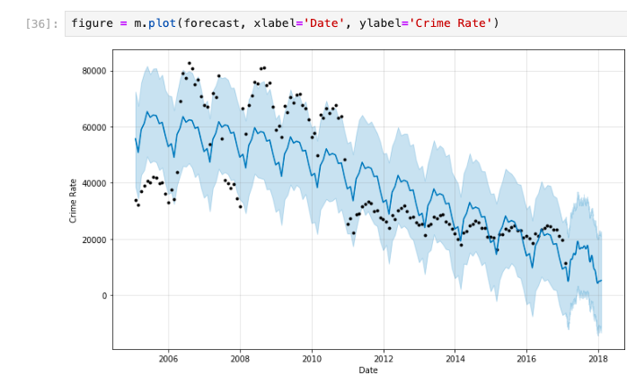

Datasource: https://www.kaggle.com/currie32/crimes-in-chicago

 ## 📊 Predictions

Using Facebook’s **Prophet** model, I generated forecasts of crime rates in Chicago.  

### Forecast Plot
The blue line represents the predicted trend, while the shaded area indicates uncertainty intervals.

### Trend & Seasonality Components
The decomposition shows the overall trend and seasonal patterns of crimes reported.

# Predict Crime Rate in Chicago
- This project focuses on analyzing and forecasting crime trends in the city of Chicago using the Chicago Crime Dataset.
- The dataset contains a summary of all reported crimes in Chicago between 2001 and 2017, covering several million records.
- The main goal of this project is to explore historical patterns in crime data and use **Facebook Prophet**  to predict future crime rates.
   **Steps in the Project**
## Step 1: Importing Data

## Step 2: Exploring the Dataset
- Basic data inspection (shape, column info, missing values).
- Checking distributions of crime types.
- Time-series visualization of reported crimes per day/month/year.
## Step 3: Preparing the Data

- Aggregating crime counts by date.
- Cleaning and transforming data for Prophet (columns ds and y).
- Handling missing or inconsistent values.
## Step 4: Modeling and Forecasting with Prophet
- Building a Prophet model to learn seasonal and yearly trends.
- Making predictions for future crime rates in Chicago.
- Visualizing forecasted results.
## Tools & Libraries
- Python 3
- pandas, numpy – data handling
- matplotlib, seaborn – visualization
- fbprophet (Prophet by Facebook) – time series forecasting

